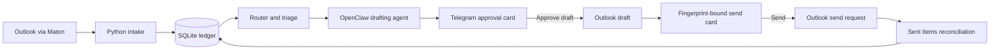

# Architecture

Mailroom is split into two runtimes that share one SQLite ledger:

- The TypeScript OpenClaw extension owns Telegram callbacks and the final
  Outlook draft/send operations.
- The bundled Python engine owns intake, routing, drafting dispatch,
  reconciliation, scheduling, and schema initialization.

The separation is explicit but versioned as one package. Deploy the TypeScript
and Python sides together.

Routing-owner scope is also shared across runtimes. The OpenClaw extension
publishes `~/.openclaw/mailroom/routing-owner-policy.json`; the Python cycle
uses it when building routing-review cards, while callbacks resolve the same
mode against the current responsibility profiles. `all` is the default and
tracks the complete profiled fleet. `selected` is an explicit operator opt-out
for agents that should not own routed email.

Responsibility profiles are stored as content-addressed versions under
`~/.openclaw/mailroom/responsibility-profiles/`. Operators do not edit
`current.json` directly; manual changes are partial JSON overrides under
`~/.openclaw/mailroom/responsibility-profile-overrides/`. Mailroom validates
those overrides, merges them into `generated-baseline.json`, and publishes a
new effective `current.json` through the same atomic version/diff path used by
scheduled generation. Keeping the generated baseline separate makes an
override reversible and prevents effective values from becoming the next
manual-edit baseline.

## Trust boundaries

1. Telegram authorization is necessary but not sufficient. The callback must
   also match its bot account, chat, message, token, production mode, and exact
   pending ledger state.
2. A send approval authorizes one canonical draft fingerprint, including
   recipients, subject, body, and attachment metadata.
3. Outlook is the source of truth for whether a message was sent. HTTP success
   alone is not the terminal state.
4. The SQLite ledger is durable coordination state. All competing transitions
   use a version claim in an immediate transaction.
5. Plugins execute as trusted Gateway code. Operators must review dependencies,
   protect the ledger and connection files, and use an explicit plugin allowlist.

## Adapter boundary

The first public adapter targets Outlook through Maton because that is the
production-tested path. Provider-specific code is isolated in `src/outlook.ts`
and the Python `Maton*` classes. Future providers should implement equivalent
intake, conversation, attachment, reply-check, draft, send, and reconciliation
contracts without weakening the state-machine invariants.

## Database ownership

`python/mailroom/ledger.py` is the canonical schema and migration owner. The
TypeScript extension may create only tables that are safe additions for callback
handling. Operators should run `mailroom init` after every upgrade and before
restarting production cycles.
