# Mailroom for OpenClaw

Mailroom automatically discovers your OpenClaw agent fleet and builds smart
Agent Responsibility Profiles from bounded, provenance-tracked workspace,
context, and memory evidence. It combines those evolving profiles with
deterministic rules and semantic triage to route Outlook email to the
best-qualified agent, while ambiguous decisions go to a human routing review.

The owning agent drafts in its persistent main session using workspace
knowledge, the complete email conversation, attachment metadata, routing
rationale, its current email workflow, and relevant authorized read-only
skills and tools. Mailroom does not depend on named skill paths: agents attest
that they used their configured email workflow, and direct availability
requests additionally require a fresh, complete calendar check plus concrete
times. Trusted OpenClaw run, session, and observed tool names are stored as
diagnostic provenance, not as approval requirements. A private Telegram
workflow provides button-based routing,
revision, deferral, safety checks, draft approval, and a separate
fingerprint-bound authorization before anything is sent.

> **Project status:** alpha. The safety invariants are extensively tested, but
> installation still assumes an Outlook connection through the Maton Graph
> gateway and a Telegram channel configured in OpenClaw.

## How Mailroom works



The editable [Mermaid source](docs/mailroom-workflow.mmd) is included with the
package. The profile generator can run on a schedule to keep responsibilities
current as agents and their workspaces evolve; persistent operator overrides
are reapplied to every generated baseline.

## Safety model

- Creating an Outlook draft never sends it.
- Sending requires a second approval bound to the exact draft fingerprint.
- Callback identity is bound to the authorized Telegram account, chat, message,
  and an opaque ledger token.
- Every state transition is persisted in SQLite with optimistic concurrency.
- Draft workers use version-bound leases, so an expired worker cannot overwrite
  a newer proposal after recovery.
- Mailroom checks Sent Items before drafting, revising, and sending so a newer
  manual reply suppresses automation.
- A successful send request remains unverified until reconciliation finds the
  approved content in Sent Items.
- Ambiguous send failures enter `SEND_OUTCOME_UNKNOWN`; Mailroom does not retry
  them as though nothing happened.

See [ARCHITECTURE.md](ARCHITECTURE.md) for the state machine and trust boundaries.

## Requirements

- OpenClaw 2026.6.11 or newer
- Node.js 22.19 or newer
- Python 3.9 or newer (the engine currently uses only the standard library)
- An OpenClaw Telegram channel with a private approval chat
- A Maton Outlook connection and `MATON_API_KEY`
- Optional `GEMINI_API_KEY` and `ANTHROPIC_API_KEY` for semantic triage and
  responsibility-profile generation

## Install from a checkout

```bash
git clone https://github.com/packwood/openclaw-plugin-mailroom.git
cd openclaw-plugin-mailroom
npm ci
npm run test:all
openclaw plugins install --link .
```

After the first ClawHub release, install the managed package instead:

```bash
openclaw plugins install clawhub:@packwood/mailroom
```

Use a private one-to-one Telegram approval chat. Natural-language revision
authorization binds the Telegram sender ID to that private chat ID; group chats
are not supported for approval or revision workflows.

Initialize the ledger before the first production cycle:

```bash
PYTHONPATH=python python3 -m mailroom.cli init
```

## Configure

Mailroom reads its plugin settings from `plugins.entries.mailroom.config`:

```json5
{
  plugins: {
    entries: {
      mailroom: {
        enabled: true,
        config: {
          telegramChatId: "123456789",
          routingOwnerMode: "all",
          accounts: {
            work: "operator@example.com"
          }
        }
      }
    }
  }
}
```

Optional settings:

| Setting | Purpose |
| --- | --- |
| `dbPath` | SQLite ledger path; defaults to `~/.openclaw/mailroom/mailroom.db` |
| `pythonExecutable` | Python command; defaults to `python3` |
| `pythonPath` | Override the bundled Python module root |
| `connectionsPath` | Override `~/.openclaw/shared/connections.json` |
| `signaturesPath` | Directory containing `<account>.html` signatures |
| `accounts` | Friendly account ID to mailbox-address map |
| `routingReviewTelegramAccountId` | Telegram account for ambiguous routing-review cards; set this to Orchestrator's account (`default` in a standard OpenClaw setup) |
| `routingReviewAgentId` | Agent whose owner cards share the routing-review Telegram account (`main` for Orchestrator); OpenClaw must bind that Telegram account to the same agent |
| `routingOwnerMode` | `all` (default) makes every profiled/discovered agent a routing owner; `selected` limits routing to `reviewOwners` |
| `reviewOwners` | Agent IDs used in `selected` mode |
| `profilesPath` | Effective responsibility-profile file; must end in `current.json` and defaults under `~/.openclaw/mailroom/` |

For guided routing-owner setup after installation, choose all agents (the
default) or a selected subset:

```bash
# Discover the fleet, generate responsibility profiles, and route to all agents
openclaw mailroom setup-routing --all --generate-profiles --restart

# Or explicitly select which discovered agents can own routed email
openclaw mailroom setup-routing --owners primary,research --restart

# Verify discovery, profile coverage, and the effective routing-owner set
openclaw mailroom routing-status
```

In `all` mode, a valid responsibility-profile set is authoritative. If profiles
have not been generated yet, Mailroom discovers the OpenClaw fleet directly.
The Python cycle and TypeScript approval callbacks share one generated policy,
so a routing choice shown on a card is also accepted when clicked.

Manual profile changes should be made through persistent overrides, not by
editing `current.json` directly. `current.json` is content-addressed and may be
replaced by the weekly generator.

```bash
# Show the effective current profile set, after overrides
openclaw mailroom profiles show --routing-only

# Show one agent's effective profile
openclaw mailroom profiles show research --routing-only

# Merge a manual override and publish the new effective profile set
openclaw mailroom profiles edit research \
  --set-json '{"mission":"Own inbound support and renewal follow-up"}'

# Open the agent's override file in $EDITOR
openclaw mailroom profiles edit research

# Remove an override and restore that agent's generated baseline values
openclaw mailroom profiles edit research --clear

# Inspect the generated baseline without manual overrides
openclaw mailroom profiles show research --raw --routing-only

# Validate current profiles plus all overrides
openclaw mailroom profiles validate

# Regenerate profiles; saved overrides are re-applied automatically
openclaw mailroom profiles generate
```

Override files live under
`~/.openclaw/mailroom/responsibility-profile-overrides/`. They may contain any
routing profile field except `sources`; partial `named_entities` overrides are
merged into the generated profile. Mailroom preserves the last generated
baseline separately as `responsibility-profiles/generated-baseline.json`, so
clearing an override restores generated values instead of retaining the prior
effective copy.

Mailroom intentionally ships without production routing rules. Copy
[`examples/rulepacks/support.json`](examples/rulepacks/support.json), replace all
example values, and pass the containing directory with `--rulepacks`. With no
rules, non-noise messages safely enter routing review.

## Run a cycle

Start with shadow mode, which performs intake and routing without drafting or
sending approval cards:

```bash
PYTHONPATH=python python3 -m mailroom.cli shadow \
  --account operator@example.com \
  --rulepacks /path/to/private/rulepacks
```

Review the ledger, then run one production cycle manually before scheduling it:

```bash
PYTHONPATH=python python3 -m mailroom.cli cycle \
  --account operator@example.com \
  --telegram-chat-id 123456789 \
  --rulepacks /path/to/private/rulepacks
```

Keep any existing production schedule disabled while updating the TypeScript
plugin and Python engine together. Build, test, initialize migrations, restart
the Gateway, run one manual cycle, and inspect its ledger events before
re-enabling recurring execution.

## Development

```bash
npm run test:all
npm run verify:package
```

The suite contains TypeScript callback/state tests and Python engine tests. New
behavior that changes a safety transition requires a regression test.

Contributions are welcome. Read [CONTRIBUTING.md](CONTRIBUTING.md) and
[SECURITY.md](SECURITY.md) before opening a pull request.

## License

Apache License 2.0. See [LICENSE](LICENSE).
